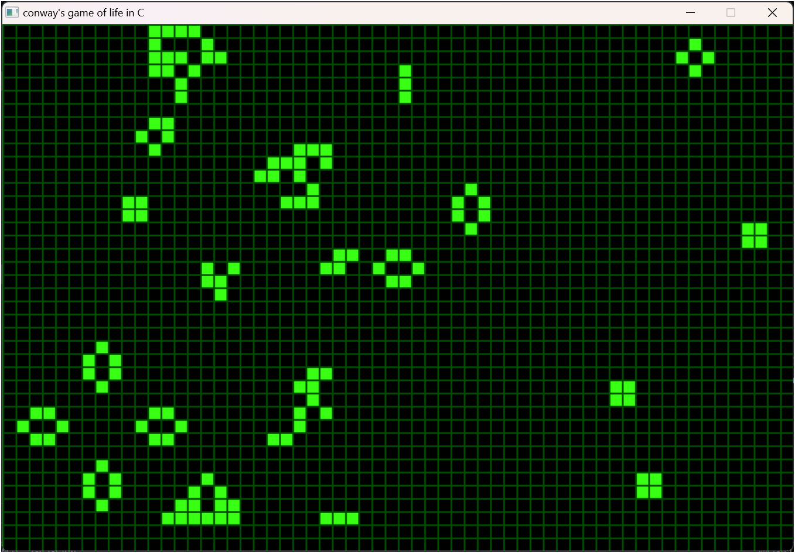

# Conway's Game of Life  

## **Overview**  
This project implements Conway's Game of Life, a cellular automaton devised by mathematician John Horton Conway. It is built in **C** using the **SDL2** library to provide an interactive and visually appealing simulation.  

The Game of Life is a zero-player game, meaning its evolution is determined by its initial state, with no further input from the user.  

---
## **Rules**  

1. **Underpopulation**  
   - Any live cell with fewer than **2 live neighbors** dies (as if by underpopulation).  

2. **Overpopulation**  
   - Any live cell with more than **3 live neighbors** dies (as if by overpopulation).  

3. **Survival**  
   - Any live cell with **2 or 3 live neighbors** survives to the next generation.  

4. **Reproduction**  
   - Any dead cell with **exactly 3 live neighbors** becomes a live cell (as if by reproduction).  


### **How the Grid Works**  
- **Neighbors**: Each cell interacts with its **8 neighbors** (horizontally, vertically, and diagonally adjacent cells).  
- The rules are applied simultaneously to every cell in the grid, creating the next "generation" of the grid.

### **Initial Configuration**
The initial state of the grid determines how the simulation will evolve. This includes patterns like still lifes, oscillators, or spaceships, depending on the initial configuration.  

### **Example Patterns**
1. **Still Lifes** (Unchanging):  
   - Block  
   - Beehive  

2. **Oscillators** (Repeat in cycles):  
   - Blinker (period 2)  
   - Toad (period 2)  

3. **Spaceships** (Move across the grid):  
   - Glider  
   - Lightweight Spaceship (LWSS)  

This simple set of rules can produce surprisingly complex and lifelike behaviors! Let me know if you'd like details on specific patterns or implementations.

---

## **Demonstration**   

1. **Simulation in Progress**  
   [](./screenshots/recording.mp4)

---

## **Getting Started**  

### **Prerequisites**  
- A C compiler (e.g., GCC or Clang).  
- SDL2 library installed on your system.  

### **Installation**  
1. Clone this repository:  
   ```bash
   git clone https://github.com/shivansh12t/gameoflife-c.git
   cd gameoflife-c
   ```

2. Compile the code using the SDL2 development libraries:  
   ```bash
   g++ -ISDL2/include -LSDL2/lib -o out main.c -lmingw32 -lSDL2main -lSDL2 -lm
   ```

3. Run the executable:  
   ```bash
   ./out.exe
   ```

---
